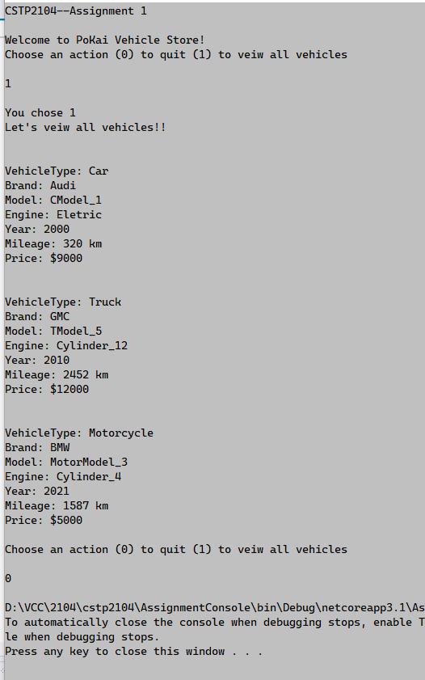

# CSTP 2104 - Windows Interactive App Prog

* Instructor: **George** 
* Student: **PoKai** 

### Assignment 1 - Object oriented design and inheritance
- Create a class design for a vehicle inventory system. Possible business goals are sales and rentals.
- This system should be capable of storing Cars, Trucks, Motorcycles of all kinds and brands.
- Since this will be a sales system, it should be able to store each vehicle's mileage, price and model specifications.
- Use inheritance and enums to make the design reusable and minimize user errors when creating new objects.

- 
